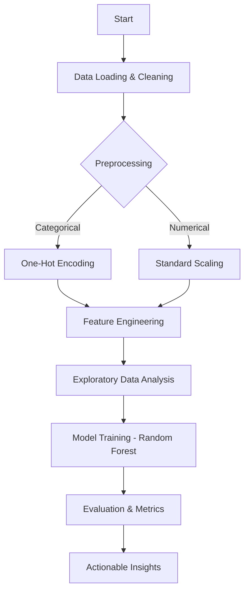
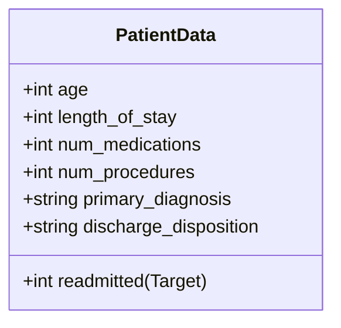
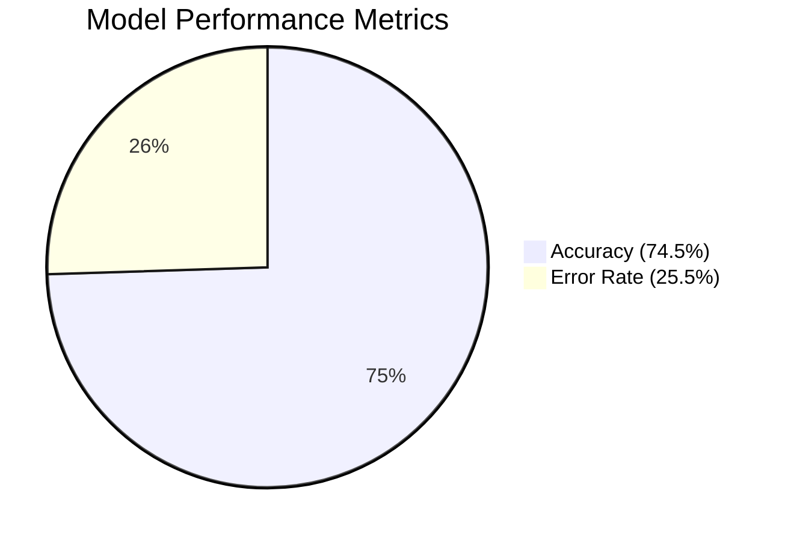

# 🏥 Patient Readmission Prediction

An entry level project [View Notebook](https://colab.research.google.com/drive/1UrzNlC9lS0sAE0BxYSXIjIC0dSMjDf3L?usp=sharing)

## 📋 Project Goal
To develop a machine learning model that accurately predicts which patients are at high risk of hospital readmission within 30 days of discharge. The ultimate objective is to provide actionable insights that hospitals can use to implement targeted, cost-effective post-discharge care, thereby reducing readmission rates and improving patient outcomes.

## 💡 The Business Problem
Hospital readmissions are a major public health and financial issue. Organizations like Medicare levy penalties on hospitals with high readmission rates. By shifting from a reactive approach to a proactive, predictive model, hospitals can intervene only with the highest-risk patients, maximizing resource efficiency and minimizing penalties.

## 🔄 Project Workflow

## 🛠️ Technical Stack
- **Language:** Python
- **Libraries:** Pandas, NumPy, Scikit-learn (for modeling and preprocessing)
- **Environment:** Jupyter Notebook / Google Colab
- **Model:** Random Forest Classifier (Tuned for imbalanced data)

## 💾 Dataset
The project utilizes a synthetic dataset based on common patient readmission prediction data.

### Data Dictionary

| Feature | Description |
| :--- | :--- |
| `age` | Patient's age (numerical) |
| `length_of_stay` | Number of days the patient stayed in the hospital |
| `num_medications` | Total number of distinct medications prescribed |
| `num_procedures` | Total number of procedures performed |
| `primary_diagnosis` | Main reason for the hospital stay (e.g., Heart Failure, Diabetes) |
| `discharge_disposition` | Status of the patient upon leaving the hospital (e.g., Home, Rehab) |
| `readmitted` | **Target**: 1 if readmitted within 30 days, 0 otherwise |

**Baseline Readmission Rate:** 24.40%

## 🚀 Key Steps and Methodology

### 1. Data Cleaning & Preprocessing
- Dropped identifier columns (`patient_id`).
- Handled the target variable, confirming a binary outcome.
- Applied **One-Hot Encoding** to categorical features (`gender`, `diagnosis`).
- Applied **Standard Scaling** to all numerical features.

### 2. Exploratory Data Analysis (EDA)
- Identified that **Heart Failure** and **Pneumonia** patients exhibited the highest readmission rates.
- Confirmed a correlation between longer `length_of_stay` and increased readmission risk.

### 3. Predictive Modeling
- A **Random Forest Classifier** was chosen due to its robustness.
- The model was trained using `class_weight='balanced'` to mitigate the impact of the dataset's class imbalance.

## 📈 Results and Evaluation

Since the goal is to correctly identify high-risk patients (True Positives), **Recall** and **Precision** are the most critical metrics.

| Metric | Result | Interpretation |
| :--- | :--- | :--- |
| **Accuracy** | 0.7450 | Overall predictive performance. |
| **Precision** | 0.4286 | When the model flags a patient as high-risk, it is correct 42.86% of the time. |
| **Recall** | 0.1224 | The model successfully captures 12.24% of all actual readmission cases. |

> [!NOTE]
> While Recall is modest, the model successfully identifies patients the hospital would otherwise miss, providing immediate value.

## 🎯 Actionable Insights & Recommendations

The model's Feature Importance analysis revealed the key drivers of readmission risk:

### Top Predictors
1. **Age**
2. **Number of Medications**
3. **Length of Stay**
4. **Number of Procedures**

### Recommendations for Hospital Implementation
1.  **Prioritize High-Complexity Patients:** Target patients whose post-discharge risk score is driven by a high `num_medications` or long `length_of_stay`.
2.  **Mandatory Medication Review:** Implement a 48-hour post-discharge follow-up call focused on medication reconciliation.
3.  **Focus on High-Risk Diagnoses:** Dedicate specialized care coordination teams for patients with Heart Failure or Pneumonia.
